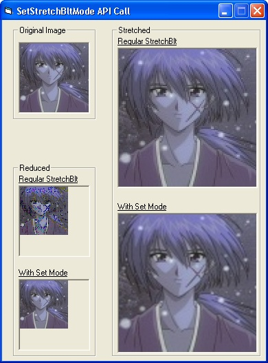



## A Higher Quality StretchBlt

### Description

Sorry if someone has already posted something on this. I did a few searches and came up with zero results, so I figured I might as well bring this function to everyone's attention. Well anyway, this program uses the SetStretchBltMode API call to greatly improve the quality of an image resized by StretchBlt--both shrinking and stretching look much better. The code should be in the zip file. Buh-bye.
 
### More Info
 

             |
---                |---
**Submitted On**   |2002-10-13 02:23:38
**By**             |[Tenjikurounin](https://github.com/Planet-Source-Code/PSCIndex/blob/master/ByAuthor/tenjikurounin.md)
**Level**          |Beginner
**User Rating**    |5.0 (99 globes from 20 users)
**Compatibility**  |VB 6\.0
**Category**       |[Windows API Call/ Explanation](https://github.com/Planet-Source-Code/PSCIndex/blob/master/ByCategory/windows-api-call-explanation__1-39.md)
**World**          |[Visual Basic](https://github.com/Planet-Source-Code/PSCIndex/blob/master/ByWorld/visual-basic.md)
**Archive File**   |[A\_Higher\_Q14533810132002\.zip](https://github.com/Planet-Source-Code/tenjikurounin-a-higher-quality-stretchblt__1-39776/archive/master.zip)

